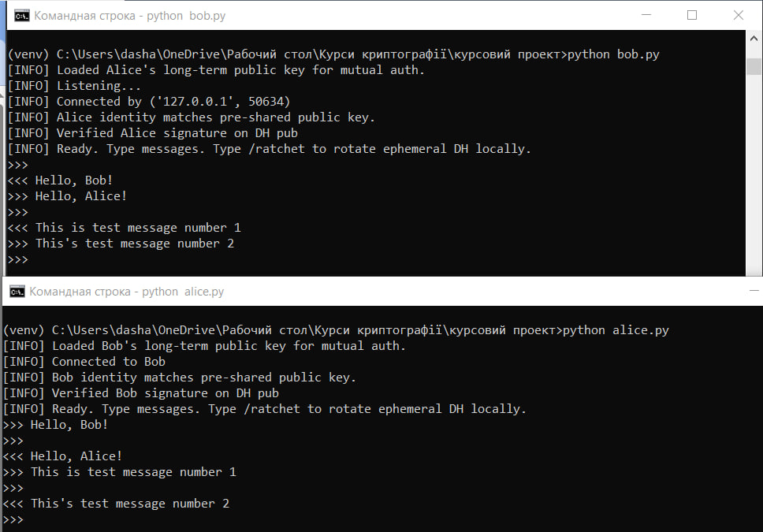

## Запуск програми
Для запуску застосунку, потрібно відкрити два термінали у директорії проекту
У першому терміналі запускаємо Bob:
```bash
python bob.py
```
Якщо у терміналі зявився такий рядок
```bash
[INFO] Listening...
```
Тоді ми можемо в другому терміналі запустити Alice:
```bash
python alice.py
```

При першому запуску програми автоматично створюють пари підписувальних ключів:
`alice_sign_priv.pem, alice_sign_pub.pem`
`bob_sign_priv.pem, bob_sign_pub.pem`
Ключі зберігаються у директорії проєкту.
Якщо ключі вже існують, вони повторно не генеруються.

За замовчуванням застосунок використовує порт `8888` для комунікації. Якщо цей порт зайнятий у вашій системі, змініть його на вільний у файлах `bob.py` та `alice.py`, у рядку: `PORT = 8888`

У терміналі з Prompt `>>>` можна вводити повідомлення та надсилати їх натиском Enter.
Prompt `<<<` вказує на отримані повідомлення від іншої сторони.

Для зупинки програми можна натиснути `Ctrl + C` у кожному терміналі.
Згенеровані ключі залишаються у директорії та можуть бути використані повторно при наступному запуску.

В разі успішного запуску застосунок повинен мати такий вигляд:



## Коротко опишіть мотивацію обраних вами криптографічних алгоритмів для забезпечення бажаних властивостей безпеки застосунку.

У цьому застосунку для захищеного обміну повідомленнями використано комбінацію сучасних криптографічних алгоритмів, кожен із яких забезпечує окремий аспект безпеки відповідно до принципів протоколу Double Ratchet. Основною метою є досягнення конфіденційності, цілісності, автентичності та пряма секретність при передачі даних між двома сторонами.

Для обміну ключами використано алгоритм X25519, який реалізує протокол Диффі–Геллмана на еліптичних кривих. Цей метод забезпечує ефективне створення спільного симетричного секрету без необхідності прямої передачі секретних ключів, що унеможливлює їх перехоплення третіми сторонами. Вибір X25519 обґрунтований його високою швидкістю, надійністю та стійкістю до сучасних криптоаналітичних атак.

Для автентифікації сторін використано Ed25519 — алгоритм цифрового підпису, який гарантує перевірку цілісності даних і справжність відправника. Він використовується для підпису публічних ключів X25519 під час початкового обміну, що забезпечує взаємну автентифікацію на основі довготермінових асиметричних ключів. Такий підхід запобігає атакам типу «людина посередині» (MITM), оскільки публічні ключі автентифікуються підписом, перевіреним заздалегідь відомим довготерміновим ключем.

Для симетричного шифрування повідомлень застосовано AES у режимі GCM, який надає одночасно конфіденційність і цілісність даних через вбудовану аутентифікацію. Завдяки механізму AEAD (Authenticated Encryption with Associated Data) гарантується, що навіть якщо повідомлення буде змінене або підроблене, воно не пройде перевірку автентичності.

Також реалізовано використання HKDF (HMAC-based Key Derivation Function) для послідовного отримання нових ключів із попередніх — це забезпечує властивість forward secrecy, оскільки компрометація поточного ключа не дозволяє відновити попередні чи майбутні ключі. Кожне нове повідомлення шифрується власним симетричним ключем, який обчислюється за допомогою HKDF із попередніх станів.

Завдяки поєднанню цих алгоритмів — X25519, Ed25519, AES-GCM та HKDF — система досягає балансу між високим рівнем безпеки, продуктивністю та простотою реалізацією. Така архітектура гарантує, що навіть у випадку часткової компрометації ключів, зловмисник не зможе розшифрувати минулі чи майбутні повідомлення, а сторони завжди можуть впевнено перевірити автентичність співрозмовника.
