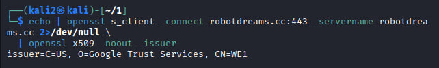
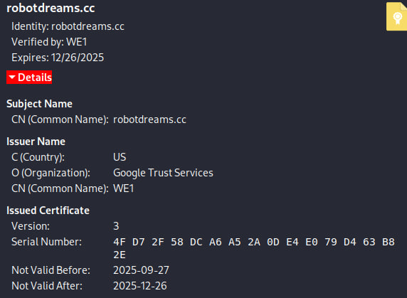
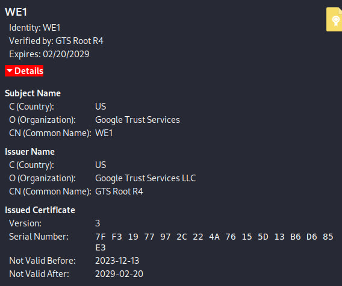
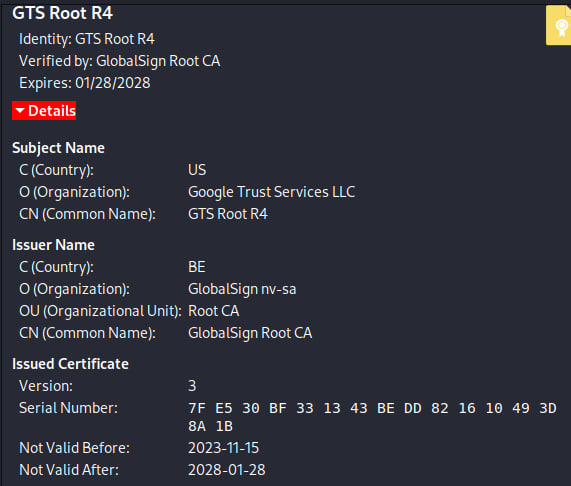
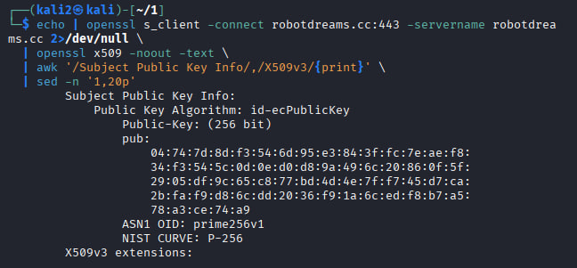
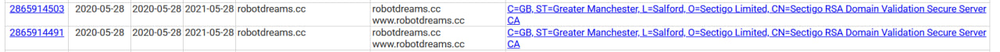

# Завдання 4

## 1. Якою є назва орагізації що видала чинний сертифікат для сайту robotdreams.cc?

Чинний сертифікат для сайту robotdreams.cc виданий організацією Google Trust Services, сертифікаційним центром WE1.

## 2. Який сертифікат з ланцюга має найдовший термін дії?

robotdreams.cc:

діє приблизно 3 місяці

WE1:

діє приблизно 5 років 2 місяці

GTS Root R4:

діє приблизно 4 років 2 місяці

Отже, найдовший термін дії має проміжний сертифікат WE1, виданий Google Trust Services, який діє приблизно п’ять років.

## 3. Дослідивши детальніше сертифікат виданий robotdreams.cc можна знайти деталі про ключ, який використовується сервером robotdreams.cc для автентифікації сервера. Який розмір ключа (в бітах) та яка еліптична крива була використана для формування ключа robotdreams.cc?

Сертифікат сайту robotdreams.cc використовує відкритий ключ розміром 256 біт, сформований на еліптичній кривій prime256v1 (NIST P-256).

# Завдання 5

## Коли (дата) був виданий найперший сертифікат для доменту robotdreams.cc (шукати по common name)?

Найперший сертифікат для домену robotdreams.cc був виданий 28 травня 2020 року компанією Sectigo Limited (CN=Sectigo RSA Domain Validation Secure Server CA).

## Який термін дії мав цей перший сертифікат?

Термін дії сертифіката складав 1 рік, тобто з 28 травня 2020 року до 28 травня 2021 року.